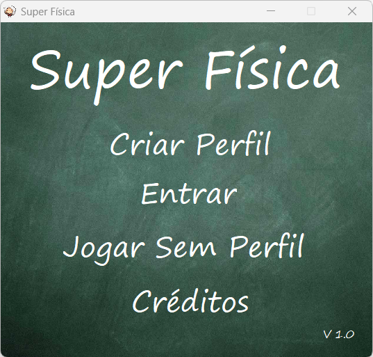
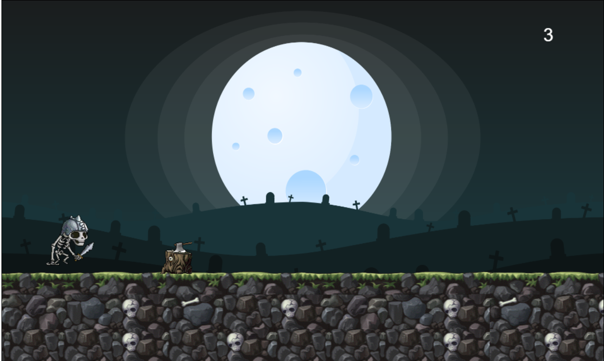

<h1 align="center">
    
  Projetos Curso Técnico Informática IFPB-CG 

</h1>

    
    
    
    

## 🔖 Sobre

Alguns projetos interessantes desenvolvidos ao longo do curso técnico integrado ao ensino médio em informática do IFPB-CG.

## 🚀 Projetos Delphi

### 🏷️ Encrypty Key

➡️ Acesse o projeto clicando [aqui](projetos/delphi/encripty-key).

### 🏷️ Jogo das Calorias

➡️ Acesse o projeto clicando [aqui](projetos/delphi/jogo-das-calorias).

### 🏷️ Jogo Super Física

➡️ Acesse o projeto clicando [aqui](projetos/delphi/jogo-super-fisica).

## 🌍 Projetos WEB

### 🏷️ Jogo Batalha Naval

➡️ Acesse o projeto clicando [aqui](projetos/web/jogo-batalha-naval).

### 🏷️ Jogo Runner

➡️ Acesse o projeto clicando [aqui](projetos/web/jogo-batalha-naval).

## 📃 Licença

Esse projeto está sob a licença MIT. Veja o arquivo [LICENSE](LICENSE) para mais detalhes.
