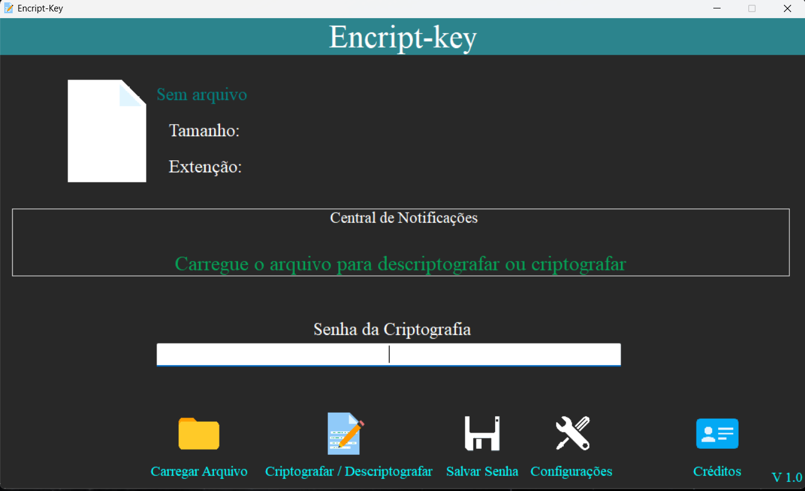
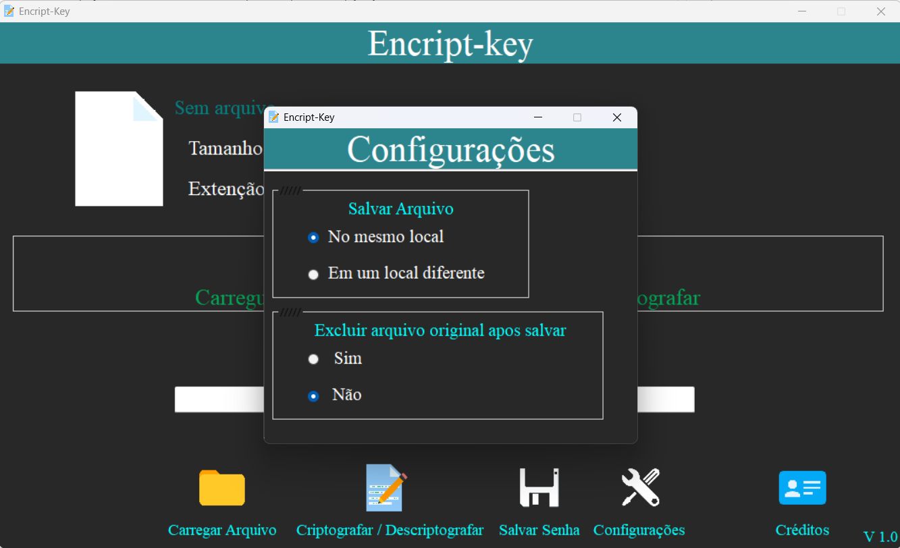
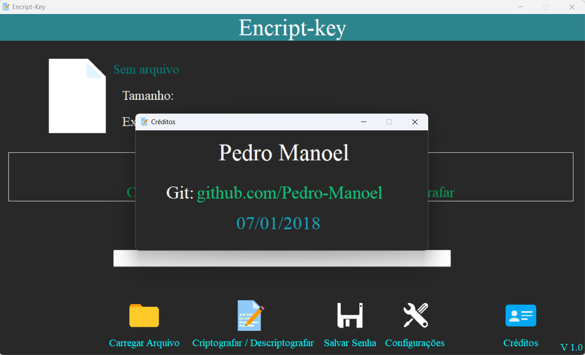
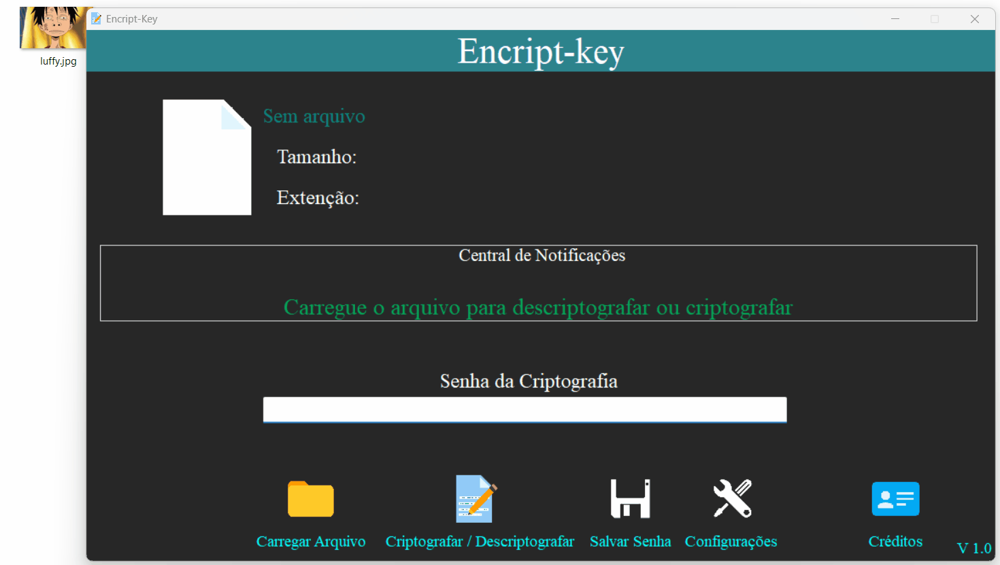

<h1 align="center">
    
 🔐 Encripty Key 

</h1>

## 🔖 Sobre

Este projeto consiste em uma aplicação executável (`exe`) desenvolvida no ambiente de programação [Delphi](https://www.embarcadero.com/products/delphi) que permite criptografar e descriptografar arquivos utilizando uma senha definida pelo usuário.

A criptografia é um método de segurança importante para proteger informações sensíveis. Com esta aplicação, o usuário pode proteger seus arquivos confidenciais de terceiros não autorizados a visualizá-los, garantindo a segurança de suas informações.

Além disso, a aplicação é fácil de usar, permitindo ao usuário criptografar e descriptografar arquivos de forma rápida e eficiente, garantindo a privacidade e a segurança de suas informações.

Portanto, se você deseja manter seus arquivos importantes em segurança, experimente esta aplicação!

➡️ O arquivo de execução do projeto encontra-se em `executável/encripty-key.exe`.

## 🖥️ Telas

## ✨ Demostração

