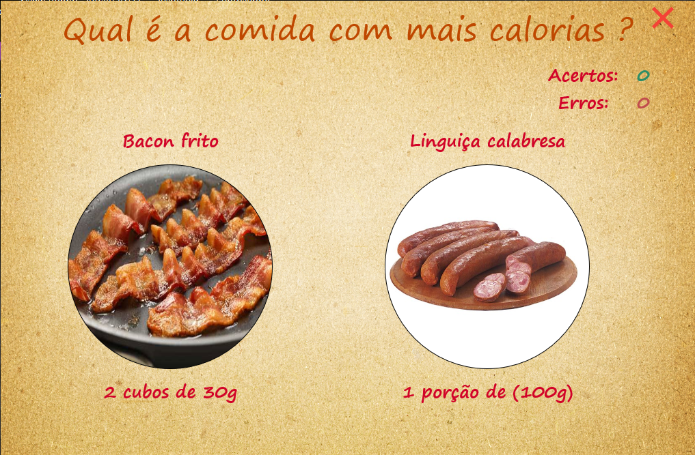
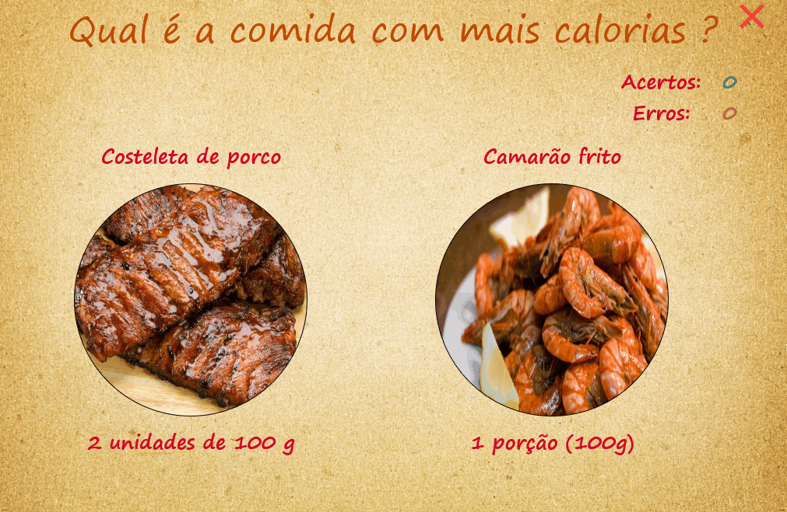

<h1 align="center">
    
 🍕 Jogo das Calorias 

</h1>

## 🔖 Sobre

O projeto consiste em um jogo executável (`exe`), desenvolvido no ambiente de programação [Delphi](https://www.embarcadero.com/products/delphi), que tem como objetivo ajudar as pessoas a aprenderem o valor calórico dos alimentos de forma divertida e interativa.

Na dinâmica do jogo, o usuário deve escolher, entre duas opções disponíveis, o alimento mais calórico de acordo com o nome e a porção apresentados. Os alimentos são gerados aleatoriamente e, ao fazer uma escolha, o valor calórico é mostrado, assim como se a resposta está correta ou não.

Com este jogo, os usuários podem aprender sobre o valor calórico dos alimentos de uma forma lúdica e envolvente, tornando o aprendizado mais eficaz e agradável.

Então, se você quer melhorar seu conhecimento sobre nutrição de uma forma divertida, experimente este jogo!

➡️ O arquivo de execução do projeto encontra-se em `executável/jogo-das-calorias.exe`.

## 🖥️ Telas

## ✨ Demostração

