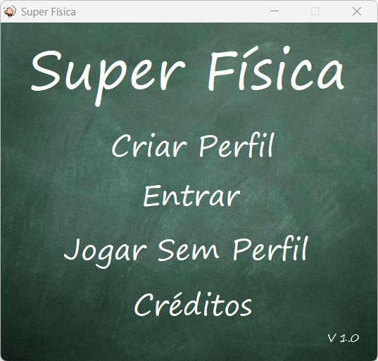
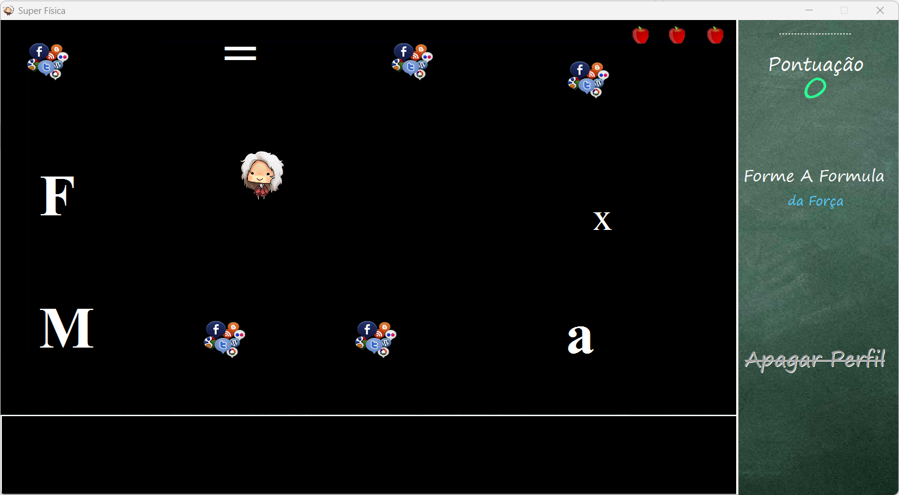
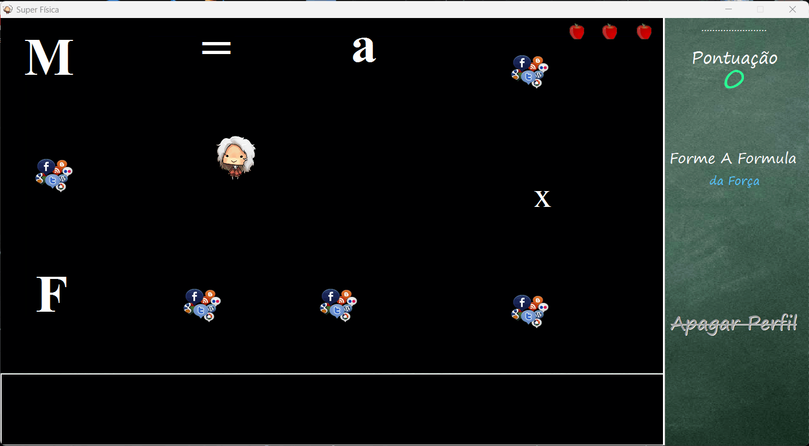

<h1 align="center">
    
 ⚡ Jogo Super Física 

</h1>

## 🔖 Sobre

O projeto consiste em um jogo executável (`exe`), desenvolvido no ambiente de programação [Delphi](https://www.embarcadero.com/products/delphi), que tem como objetivo ajudar as pessoas a aprenderem fórmulas físicas de uma maneira divertida e interativa.

Na dinâmica do jogo, o jogador assume o papel de um jovem cientista que precisa da ajuda do jogador para formar as fórmulas físicas requisitadas. Se o jogador acertar a ordem dos componentes da fórmula, ele ganha pontos e continua jogando. Se o jogador errar a ordem dos componentes ou perder todas as três maçãs, ele perde a partida e uma pontuação correspondente. No entanto, o jogador pode continuar jogando e tentar ganhar pontos adicionais em outras partidas.

Com este jogo, os usuários podem aprender fórmulas físicas de uma forma lúdica e envolvente, tornando o aprendizado mais eficaz e agradável. Além disso, o jogo possui elementos desafiadores, como as distrações das redes sociais e a troca de lugar constantes entre os componentes, que tornam o jogo ainda mais divertido e envolvente.

Então, se você quer aprender fórmulas físicas de uma forma divertida e desafiadora, experimente este jogo!

➡️ O arquivo de execução do projeto encontra-se em `executável/jogo-super-fisica.exe`.

## 🖥️ Telas

## ✨ Demostração

