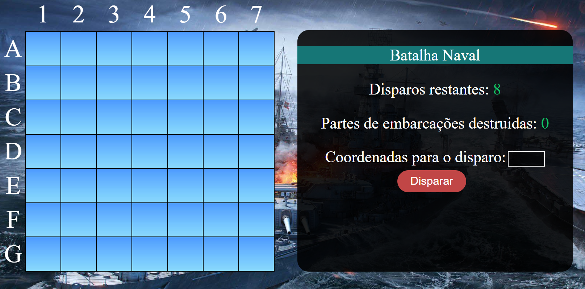
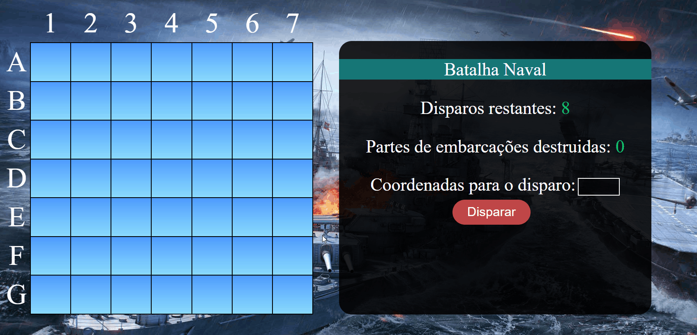

<h1 align="center">
    
 🛳️ Jogo Batalha Naval 

</h1>

## 🔖 Sobre

O projeto consiste em um jogo de batalha naval desenvolvido para a web, utilizando as mais recentes tecnologias HTML5, CSS3 e JavaScript.

Você irá assumir o comando de uma frota naval em uma missão perigosa para proteger seu país contra ataques inimigos.
Sua missão é liderar sua equipe em batalhas emocionantes no mar, lutando com estratégia e habilidade para destruir a frota inimiga e proteger seus aliados.

Para jogar, basta abrir o arquivo [index.html](index.html) em seu navegador e começar a luta agora mesmo!

## 🖥️ Telas

## ✨ Demostração

